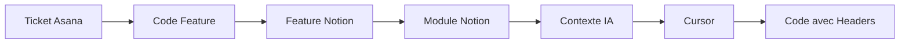

# NotionDev

> **Intégration Notion ↔ Asana ↔ Git pour développeurs**  
> Accélérez votre développement avec un contexte IA automatique depuis vos spécifications Notion

NotionDev permet aux développeurs de charger automatiquement le contexte complet de leurs features depuis Notion directement dans leur IDE (Cursor), tout en synchronisant avec leurs tickets Asana.


## ✨ Fonctionnalités

- 🎯 **Workflow intégré** : Ticket Asana → Documentation Notion → Contexte IA → Code
- 🤖 **IA Context automatique** : Export direct vers Cursor avec specs complètes
- 🔄 **Multi-projets** : Détection automatique du projet courant
- 📋 **Traçabilité** : Headers automatiques dans le code pour lier fonctionnel ↔ technique
- 🚀 **Zero config par projet** : Une seule configuration globale pour tous vos projets

## 🎯 Cas d'usage

**Avant NotionDev :**
```bash
# Workflow manuel et dispersé
1. Ouvrir ticket Asana
2. Chercher la documentation dans Notion  
3. Copier-coller des specs dans Cursor
4. Coder sans contexte complet
5. Oublier de documenter les liens code ↔ fonctionnel
```

**Avec NotionDev :**
```bash
# Workflow automatisé et intégré
notion-dev work TASK-123456789
# → Charge automatiquement tout le contexte dans Cursor
# → Génère les headers de traçabilité
# → Prêt à coder avec l'IA !
```

## 📋 Prérequis

- **Python 3.9+**
- **macOS** (Linux/Windows : bientôt supportés)
- **Accès APIs** : Notion + Asana
- **Structure Notion** : Databases "Modules" et "Features" avec codes features

### Structure Notion requise

Votre workspace Notion doit contenir :

**Database "Modules" :**
- `name` (Title) : Nom du module
- `description` (Text) : Description courte  
- `status` (Select) : draft, review, validated, obsolete
- `application` (Select) : service, backend, frontend
- `code_prefix` (Text) : Préfixe des codes features (AU, DA, API...)

**Database "Features" :**
- `code` (Text) : Code unique (AU01, DA02...)
- `name` (Title) : Nom de la feature
- `status` (Select) : draft, review, validated, obsolete
- `module` (Relation) : Lien vers le module parent
- `plan` (Multi-select) : Plans de souscription  
- `user_rights` (Multi-select) : Droits d'accès

## 🚀 Installation

### Installation automatique

```bash
# 1. Cloner le repository
git clone https://github.com/votre-org/notion-dev.git
cd notion-dev

# 2. Lancer l'installation
chmod +x install_notion_dev.sh
./install_notion_dev.sh
```

Le script d'installation va :
- ✅ Vérifier Python 3.9+
- ✅ Créer un environnement virtuel
- ✅ Installer toutes les dépendances
- ✅ Configurer l'alias global `notion-dev`
- ✅ Créer le template de configuration

### Configuration

#### 1. Récupérer les tokens API

**🔑 Token Notion :**
1. Aller sur https://www.notion.so/my-integrations
2. Créer une nouvelle intégration "NotionDev"
3. Copier le token (commence par `secret_`)
4. Donner accès aux databases "Modules" et "Features"

**🔑 Token Asana :**
1. Aller sur https://app.asana.com/0/my-apps
2. Créer un "Personal Access Token"
3. Copier le token généré

**📋 IDs Notion :**
- Ouvrir votre database → URL : `notion.so/workspace/[DATABASE_ID]?v=...`
- Copier l'ID pour Modules et Features

#### 2. Configurer le fichier

```bash
# Copier le template
cp ~/.notion-dev/config.example.yml ~/.notion-dev/config.yml

# Éditer avec vos tokens
nano ~/.notion-dev/config.yml
```

```yaml
notion:
  token: "secret_VOTRE_TOKEN_NOTION"
  database_modules_id: "xxxxxxxx-xxxx-xxxx-xxxx-xxxxxxxxxxxx"  
  database_features_id: "xxxxxxxx-xxxx-xxxx-xxxx-xxxxxxxxxxxx"

asana:
  access_token: "x/VOTRE_TOKEN_ASANA"
  workspace_gid: "1234567890123456"
  user_gid: "1234567890123456"
```

#### 3. Tester l'installation

```bash
# Test complet de la configuration
~/notion-dev-install/test_config.sh

# Premier test
notion-dev tickets
```

## 📖 Utilisation

### Commandes principales

```bash
# Voir les infos du projet courant
notion-dev info

# Lister vos tickets Asana assignés  
notion-dev tickets

# Travailler sur un ticket spécifique
notion-dev work TASK-123456789

# Générer le contexte pour une feature
notion-dev context --feature AU01

# Mode interactif
notion-dev interactive
```

### Workflow développeur type

#### 🌅 Matin - Choisir son ticket

```bash
cd ~/projets/mon-saas-frontend
notion-dev tickets
```

```
                    Mes Tickets Asana                    
┏━━━━━━━━━┳━━━━━━━━━━━━━━━━━━━━━━━━━━━━━━━━━━┳━━━━━━━━━━━━━━━┳━━━━━━━━━━━━━┓
┃ ID      ┃ Nom                            ┃ Feature     ┃ Statut      ┃
┡━━━━━━━━━╇━━━━━━━━━━━━━━━━━━━━━━━━━━━━━━━━━━╇━━━━━━━━━━━━━━━╇━━━━━━━━━━━━━┩
│ 23456789│ Implémenter SSO Google         │ AU02        │ 🔄 En cours │
│ 34567890│ Dashboard analytics            │ DA01        │ 🔄 En cours │
└─────────┴────────────────────────────────┴─────────────┴─────────────┘
```

#### 🎯 Démarrer le travail

```bash
notion-dev work 1234567890123456
```

```
📋 Ticket Asana
AU02 - Implémenter SSO Google

ID: 1234567890123456
Feature Code: AU02
Status: 🔄 En cours
Projet: mon-saas-frontend

🎯 Feature
AU02 - SSO Google Login

Module: User Authentication
Status: validated
Plans: premium
User Rights: standard, admin

Exporter le contexte vers Cursor? [Y/n]: y
✅ Contexte exporté vers /Users/dev/projets/mon-saas-frontend/.cursor/
💡 Vous pouvez maintenant ouvrir Cursor et commencer à coder!
```

#### 💻 Développer avec Cursor

```bash
# Ouvrir Cursor avec le contexte chargé
cursor .
```

Le contexte IA contient automatiquement :
- ✅ Spécifications complètes de la feature AU02
- ✅ Documentation du module User Authentication  
- ✅ Standards de code avec headers obligatoires
- ✅ Instructions pour l'IA adaptées au projet

#### 🔄 Changer de projet

```bash
# Passer à un autre projet - détection automatique
cd ~/projets/mon-saas-api
notion-dev info
```

```
📊 Projet: mon-saas-api
Nom: mon-saas-api
Chemin: /Users/dev/projets/mon-saas-api
Cache: /Users/dev/projets/mon-saas-api/.notion-dev
Git Repository: ✅ Oui
```

### Headers de traçabilité

NotionDev génère automatiquement des headers dans vos fichiers pour maintenir la traçabilité :

```typescript
/**
 * NOTION FEATURES: AU02
 * MODULES: User Authentication
 * DESCRIPTION: Service d'authentification Google OAuth
 * LAST_SYNC: 2025-01-15
 */
export class GoogleAuthService {
  // Implementation...
}
```

## 🏗️ Architecture

### Multi-projets automatique

NotionDev détecte automatiquement le projet depuis le dossier courant :

```bash
~/projets/
├── saas-frontend/          # notion-dev → Context "saas-frontend"
│   └── .notion-dev/        # Cache isolé
├── saas-api/              # notion-dev → Context "saas-api"  
│   └── .notion-dev/        # Cache isolé
└── saas-admin/            # notion-dev → Context "saas-admin"
    └── .notion-dev/        # Cache isolé
```

### Flux de données



## ⚙️ Configuration avancée

### Optimisation pour votre IA

```yaml
ai:
  # Pour Claude Opus/Sonnet (recommandé)
  context_max_length: 100000
  include_code_examples: true
  
  # Pour GPT-3.5 (plus limité)
  context_max_length: 32000
  include_code_examples: false
```

### Alias shell personnalisé

```bash
# Dans ~/.zshrc ou ~/.bash_profile
alias nd="notion-dev"
alias ndt="notion-dev tickets"
alias ndw="notion-dev work"
alias ndi="notion-dev info"
```

## 🔧 Dépannage

### Erreurs courantes

**❌ "Configuration invalide"**
```bash
# Vérifier les tokens
notion-dev info
# Retester la config
~/notion-dev-install/test_config.sh
```

**❌ "Feature not found"**
- Vérifier que le code feature existe dans Notion
- Vérifier le format du code (AU01, DA02...)
- Vérifier que l'intégration Notion a accès aux databases

**❌ "Module 'asana' has no attribute 'Client'"**
- Version Asana corrigée dans le script d'installation
- Réinstaller avec le script mis à jour

### Logs de debug

```bash
# Voir les logs détaillés
tail -f ~/.notion-dev/notion-dev.log

# Debug avec niveau verbose
export NOTION_DEV_LOG_LEVEL=DEBUG
notion-dev tickets
```

## 🤝 Contribution

### Développement local

```bash
# Cloner et installer en mode développement
git clone https://github.com/votre-org/notion-dev.git
cd notion-dev
python -m venv venv
source venv/bin/activate
pip install -e .
```

### Structure du projet

```
notion-dev/
├── notion_dev/
│   ├── core/              # Logique métier
│   │   ├── config.py      # Configuration multi-projets
│   │   ├── asana_client.py # Client Asana API
│   │   ├── notion_client.py # Client Notion API
│   │   └── context_builder.py # Générateur contexte IA
│   ├── cli/
│   │   └── main.py        # Interface CLI
│   └── models/            # Modèles de données
├── install_notion_dev.sh  # Script d'installation
└── README.md
```

## 📝 Changelog

### v1.0.0 (2025-01-26)
- ✅ Version initiale
- ✅ Support multi-projets automatique
- ✅ Intégration Notion + Asana + Cursor
- ✅ Headers de traçabilité automatiques
- ✅ Client Asana API 5.2.0 compatible

## 📄 License

MIT License - voir [LICENSE](LICENSE) pour plus de détails.

## 💬 Support

- **Issues** : [GitHub Issues](https://github.com/votre-org/notion-dev/issues)
- **Documentation** : [Wiki](https://github.com/votre-org/notion-dev/wiki)
- **Discussions** : [GitHub Discussions](https://github.com/votre-org/notion-dev/discussions)

---

**Développé avec ❤️ pour accélérer le développement avec l'IA**
